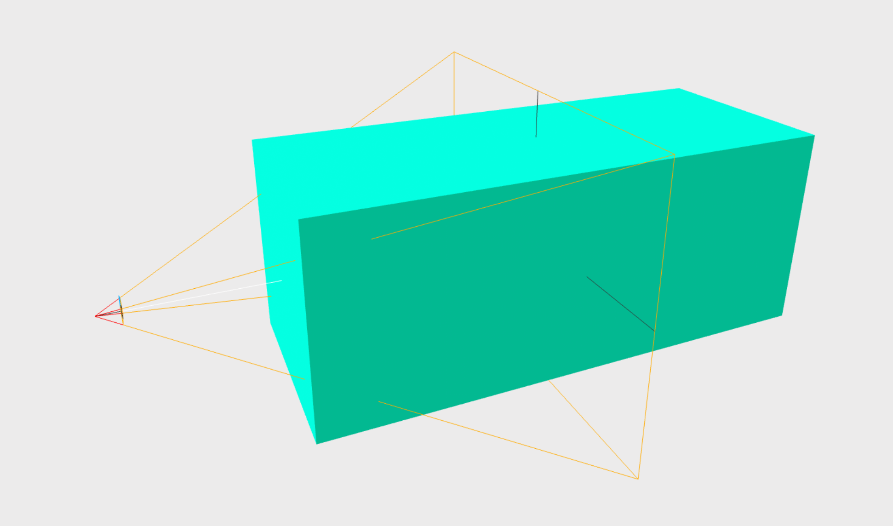

<script setup lang="ts">
import { ref, onMounted } from "vue";
import ComponentExample from "../vue/ComponentExample.vue";

const renderScene = ref(false);

onMounted(async () => {
    try {
        await import("spatial-design-system/components/position.js");
        renderScene.value = true;
    } catch (e) {
        console.error(e);
    }
});
</script>

# {{ $frontmatter.title }}

Resizes the object to fit the user's viewport. This component calculates a new scale to fit the object into the screen based on camera's FOV (field of view) and distance between the camera and the object.

The algorithm ensures that the whole object is always visible. It checks the object in two dimensions, comparing X size to horizontal FOV and Y size to vertical FOV.

It works well for flat objects like planes. For objects with depth, see [Fitting deeper objects](#fitting-deeper-objects) below.

See [adaptive guidelines](/guidelines/adaptive) for more information.

## Example

Applying fit-into-fov to a plane with the margin set to 10. Initially the plane will take up the full screen's height or width, depending on the device (mobile, desktop), and then margin (space) is added.

The margin value is a percentage value and is applied to the scale of the object by scaling it down. The actual space (scale reduction) is calculated as `visibleScreenWidth * margin` or `visibleScreenHeight * margin`, depending on the device. Before calculation margin is multiplied by 2, similar to CSS. So here margin is 10, then the plane's scale will take 80% and margin 20% in total (10% for each side on the axis).

The fitting happens once when the component is mounted and loaded. Emit `fit` event on the element to perform fitting manually whenever you want.
Or combine it with [auto-scale](/ar-vr-components/auto-scale) to fit the object into the screen when the camera moves.

<ComponentExample :fixed="true">

<template #output v-if="renderScene">
<a-plane
position="0 1.6 -4"
color="#03FCC6"
fit-into-fov="margin: 10"

> </a-plane>
> </template>

<template #code>

```js
import "spatial-design-system/components/position.js";
```

```html-vue
<a-plane
    position="0 1.6 -4"
    color="#03FCC6"
    fit-into-fov="margin: 10"
></a-plane>
```

</template>

</ComponentExample>

## Combination with other components

Below is an example with a combination of [follow-camera](/ar-vr-components/follow-camera), [billboard](/ar-vr-components/billboard) and [auto-scale](/ar-vr-components/auto-scale).
This causes the object to follow the user, face always towards the camera, and scale automatically, so it is always in front of the user's eyes and fits into the screen.

Rotate the camera using your mouse or touch to see the effect.

<ComponentExample>

<template #output v-if="renderScene">
<a-plane
position="0 1.6 -4"
color="#03FCC6"
auto-scale
billboard
fit-into-fov="margin: 10;"
follow-camera="angle: 1;"

> </a-plane>
> <a-box position="0 -0.7 0" width="14" height="0.1" depth="14" src="../grid-light-1850w.png"></a-box>
> </template>

<template #code>

```js
import "spatial-design-system/components/position.js";
```

```html-vue
<a-plane
    position="0 1.6 -4"
    color="#03FCC6"
    auto-scale
    billboard
    fit-into-fov="margin: 10;"
    follow-camera="angle: 1;"
></a-plane>
```

</template>

</ComponentExample>

## Props

| Property       | Type                | Default | Description                                                                                                                                                                                                                                                                  |
| -------------- | ------------------- | ------- | ---------------------------------------------------------------------------------------------------------------------------------------------------------------------------------------------------------------------------------------------------------------------------- |
| _margin_       | number (percentage) | 0       | Adds space. Basically it affects object's scale. For example, if `margin: 10`, then object's scale will take 80% and margin 20% in total (10% for each side on the axis). <br><br> The margin is calculated from screen dimensions and its value should be between 0 and 50. |
| _useFrontFace_ | boolean             | false   | If `false`, the center of the object is used for calculation. For objects with bigger depth, set to `true` and see [Fitting deeper objects](#fitting-deeper-objects) below.                                                                                                  |

## Events

| Event | Properties | Description                     |
| ----- | ---------- | ------------------------------- |
| _fit_ | -          | Run fitting algorithm manually. |

## Fitting deeper objects

A-FRAME uses an object's center to determine its position. This is not ideal for calculating the distance between the camera and the object that is necessary for the fit-into-fov component.
If this center point is used to find the distance, the box will be too large to fit into FOV.
The reason is perspective distortion. The front face of the object appears larger than its center, not fitting into FOV.

See the image below for an example. The center of the box is scaled correctly to fit into FOV, but the front face of the box is out of the camera's frustum (frustum is shown as yellow lines; the box front face is on the left towards the camera).

Hence, if you want to apply `fit-into-fov` to an object with some depth, set `useFrontFace` to `true`.
The front face (closest to the camera) of the object's bounding box will be used in the calculation. This ensures that the object will always fit into the camera's FOV.
However, this approach has two limitations. First, it requires several iterations of the algorithm and is slower. Second, it assumes that object's shape is similar to a box.


