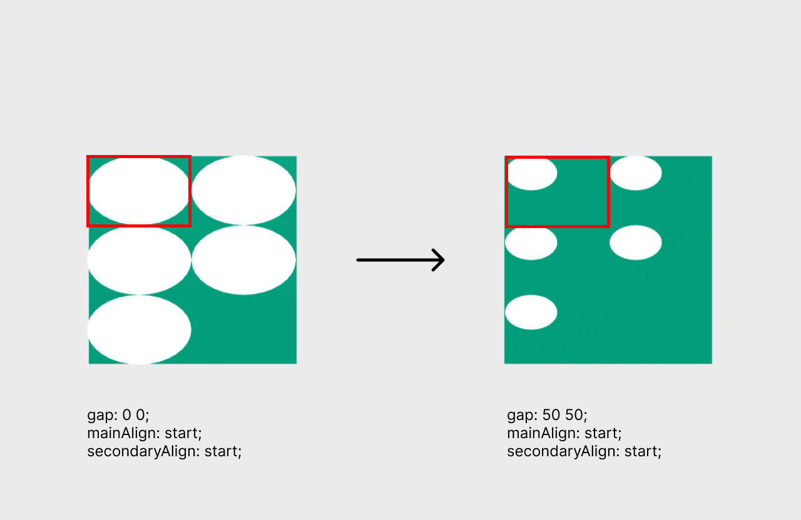
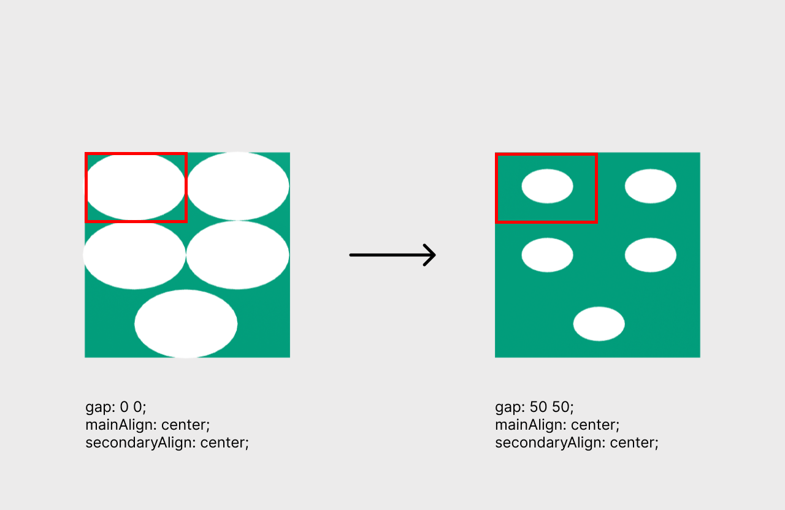

<script setup lang="ts">
import { ref, onMounted } from "vue";
import ComponentExample from "../vue/ComponentExample.vue";

const renderScene = ref(false);

onMounted(async () => {
  try {
    await import("spatial-design-system/components/flexbox.js");
    renderScene.value = true;
  } catch(e) {
    console.error(e);
  }
});
</script>

# {{ $frontmatter.title }}

Creates a one-dimensional layout, similar to [CSS Flexbox](https://developer.mozilla.org/en-US/docs/Web/CSS/flex).

Flexbox consists of two parts: **container** (parent element) and **items** (child nodes of the container). The container must be a primitive that has width and height, such as a box, a plane or an entity with geometry like the previous mentioned. One of the dimensions is the _main_ and affects the overall arrangement.

By default flexbox will place all items into one _row_ or _column_ depending on the `direction` value. Use `wrap` to have multiple rows or columns. The number of items that can fit in a row or column is set via `width` and `height` element attributes. For example, if you set flexbox `wrap: true; direction: row;` and `width="2"`, then each row will have a maximum of two items.

The items themselves are automatically scaled to fit in the flexbox, so you can use any [A-Frame primitives](https://aframe.io/docs/1.5.0/introduction/html-and-primitives.html#primitives) within the component.

## Example

<ComponentExample :fixed="true">

<template #output v-if="renderScene">
<a-plane
position="0 1.6 -3"
width="2"
height="2"
material="color: #018A6C"
flexbox="
direction: row;
mainAlign: center;
secondaryAlign: center;
gap: 50 50;
wrap: true;
">

  <a-plane color="white"></a-plane>
  <a-plane color="white"></a-plane>
  <a-plane color="white"></a-plane>
  <a-plane color="white"></a-plane>
</a-plane>
</template>

<template #code>

```js
import "spatial-design-system/components/flexbox.js";
```

```html
<a-plane
  position="0 1.6 -3"
  width="2"
  height="2"
  material="color: #018A6C"
  flexbox="
      direction: row;
      mainAlign: center;
      secondaryAlign: center;
      gap: 50 50;
      wrap: true;
  "
>
  <a-plane color="white"></a-plane>
  <a-plane color="white"></a-plane>
  <a-plane color="white"></a-plane>
  <a-plane color="white"></a-plane>
</a-plane>
```

</template>

</ComponentExample>

## Props

| Property         | Type                                                  | Default | Description                                                                                                                                                                                                                                                                                                                                                                                                                                     |
| ---------------- | ----------------------------------------------------- | ------- | ----------------------------------------------------------------------------------------------------------------------------------------------------------------------------------------------------------------------------------------------------------------------------------------------------------------------------------------------------------------------------------------------------------------------------------------------- |
| _direction_      | enum(row, column)                                     | row     | Defines the direction in which the items in the flexbox are arranged.                                                                                                                                                                                                                                                                                                                                                                           |
| _gap_            | vec2                                                  | 0 0     | Sets the space inside the item cell. The first value is the space in the main axis and the second in the secondary axis. <br><br> Gap values are percentages and must be between 0 and 100 (not included). For example, `gap: 50 50` creates a space in the cell occupying 50% in both axes. <br><br> If `mainAlign` is set to `space-around` or `space-between`, then space is automatically adjusted and the gap for main axis has no effect. |
| _mainAlign_      | enum(start, center, end, space-around, space-between) | start   | Aligns items along the main axis. If `direction` is set to `column`, it aligns along the secondary axis.                                                                                                                                                                                                                                                                                                                                        |
| _secondaryAlign_ | enum(start, center, end, stretch)                     | stretch | Aligns items along the secondary axis. If `direction` is set to `column`, it aligns along the main axis.                                                                                                                                                                                                                                                                                                                                        |
| _wrap_           | boolean                                               | false   | Wraps items into multiple rows/columns if the item position exceeds the container boundary.                                                                                                                                                                                                                                                                                                                                                     |

## How does gap work?

The `gap` property allows to add more space for each cell in the container. This is an important factor, because it affects the whole arrangement. For instance, consider the following layout:



The left plane has no gap, thus each item takes the whole cell space. When you set a gap, for instance `gap: 50 50`, as in the right plane, the scale of each item will be reduced. In this case, they occupy 50% percent on both axes and the remaining 50% on both axes is space.

The position of the items will be updated with respect to the alignment values. In the above example the items are positioned at the beginning of both axes. If you have other alignment values, such as `center`, then items will be placed according to those alignment values and gap. For example:


