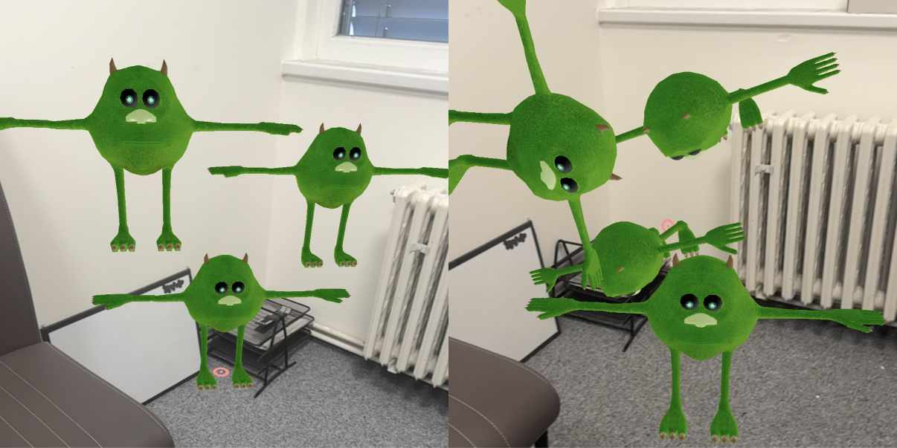
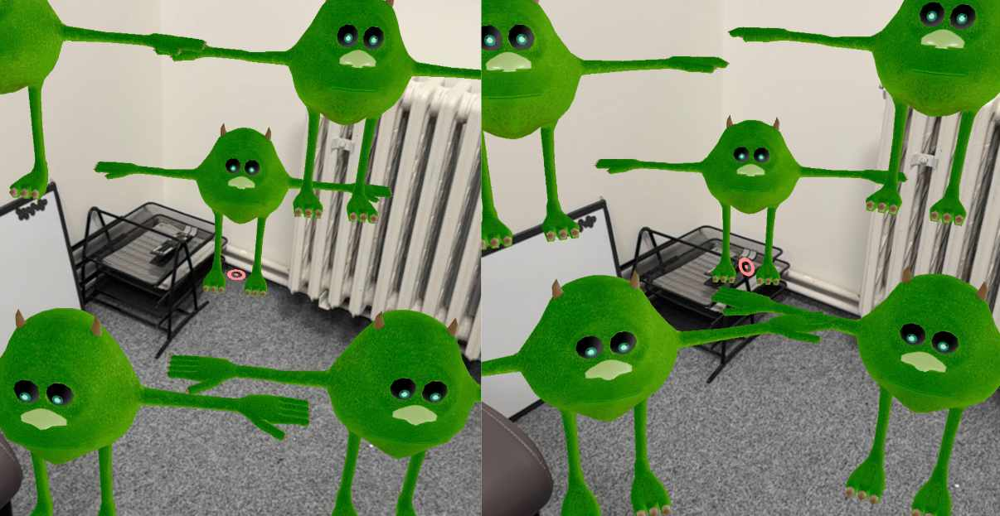
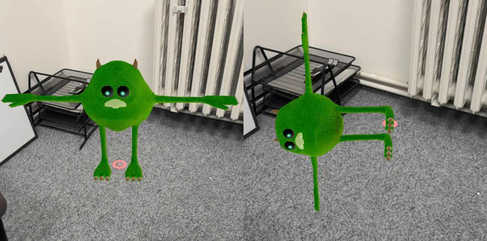

# place-object

The `place-object` component enables placing virtual objects in AR environments by tapping on detected real-world surfaces. It provides sophisticated control over how objects are positioned and oriented relative to the surface.

## Props

| Property | Type | Default | Description |
| --- | --- | --- | --- |
| *heightRange* | vec2 | `{ x: 0.3, y: 2.0 }` | Min/max height range for valid placement (meters) |
| *surfaceTypes* | array | `["horizontal"]` | Valid surface types: "horizontal", "wall", "ceiling" |
| *distanceRange* | vec2 | `{ x: 0.5, y: 5.0 }` | Min/max distance from camera for valid placement |
| *scale* | number | 1.0 | Scale applied to the placed object |
| *adjustOrientation* | boolean | true | Whether to adjust object orientation based on surface type. The places object will keep a relative position to surface. |
| *customRotation* | vec3 | `{ x: 0, y: 0, z: 0 }` | Custom rotation in degrees applied after basic orientation |
| *faceCamera* | boolean | true | Orient the object toward the camera's position. |

## Events

| Event | Properties | Description |
| --- | --- | --- |
| *object-placed* | `{ entity, position, orientation }` | Fired when an object is successfully placed |

# How Object Orientation Works

Understanding how the orientation properties work together is crucial for achieving the desired placement:

## The Placement Process

When an object is placed, the following sequence occurs:

1. The object's position is set to the hit point on the surface
2. The object's rotation is reset to identity (zero rotation)
3. If `adjustOrientation` is true:
   - The surface type is detected (floor, wall, ceiling)
   - Basic orientation is applied based on surface type
   - If `faceCamera` is true, additional rotation is applied to face the camera
4. If `adjustOrientation` is false but `faceCamera` is true:
   - The object is rotated to face the camera directly
5. Custom rotation is applied from the `customRotation` property
6. The object is scaled according to the `scale` property

Object visibility is optional, but upon placement, `visible: true;` will be set to the placed object.

## Understanding adjustOrientation

The `adjustOrientation` property determines whether the system should automatically orient the object based on surface type:

| adjustOrientation | Result | When to use |
| --- | --- | --- |
| true | Object orientation is adjusted based on surface type | Most cases - ensures consistent placement across surfaces |
| false | Object maintains its original orientation | When you need complete control over orientation or want the same orientation regardless of surface |

<picture>
    <source srcset="../assets/components/place-object/glb_vs_adjustOrientaion-glb.jpg">
    
    Left: adjustOrientation: false
    <br />
    Right: adjustOrientation: true
</picture>

## Understanding faceCamera

The `faceCamera` property rotates the object to face the user's viewpoint. If

| Surface Type | faceCamera | Result |
| --- | --- | --- |
| Floor | true | Object rotates around Y-axis to face camera position |
| Wall | true | Object rotates to face camera while maintaining "standing" orientation - if text is present, it stays readible |
| Ceiling | true | Object rotates around Y-axis to face camera position |

When `adjustOrientation` is false, `faceCamera` simply rotates the object around its Y-axis to face the camera.

<picture>
    <source srcset="../assets/components/place-object/glb_vs_faceCamera-glb.jpg">
    
    Left: faceCamera: false
    <br />
    Right: faceCamera: true
</picture>

## Understanding customRotation

The `customRotation` property applies additional rotation (in degrees) after all other orientation adjustments:

- Rotation is applied in X, Y, Z order
- Values are in degrees (not radians)
- Rotation is relative to the object's current orientation after all other adjustments
- Useful for fine-tuning orientation or creating intentionally angled placements

<picture>
    <source srcset="../assets/components/place-object/glb_vs_customRotation-glb.jpg">
    
    Left: customRotation: 0, 0, 0
    <br />
    Right: customRotation: 0, 0, 90
</picture>

## Usage Examples

### Standard 3D Model Placement

```html
<a-entity
  id="chair-model"
  gltf-model="#chair"
  place-object="
    surfaceTypes: horizontal;
    adjustOrientation: true;
    faceCamera: true"
  visible="false">
</a-entity>
