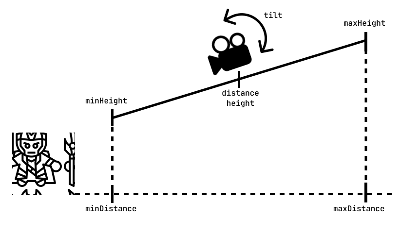

<script setup lang="ts">
  import { ref, onMounted } from "vue";
  import ComponentExample from "../vue/ComponentExample.vue";

  const renderScene = ref(false);

  onMounted(async () => {
    try {
      // Here import Spatial Design System components that you need
      await import("spatial-design-system/components/position.js");
      renderScene.value = true;
    } catch (e) {
      console.error(e);
    }
  });
</script>

# {{ $frontmatter.title }}
The `game-view` component is used to control the camera in an A-Frame scene. It allows you to choose different camera modes, from a fixed static view to third-person or first-person style views that follow a character. The component also supports zoom and controlled rotation.

::: warning ⚠️ PHYSICS ENGINE
The _game-view_ component rely on the Ammo.js physics engine. Ensure that Ammo.js is installed in your project for proper functionality.
:::

## How it works 
1. Set the [type](#type) property to choose the camera mode (default: `thirdPersonFixed`).
2. If you use [thirdPersonFixed](#thirdpersonfixed), [thirdPersonFollow](#thirdpersonfollow), or [quarterTurn](#quarterturn), set the `target` property to define which entity the camera should follow.
3. For these target-based modes, adjust the camera position and angle using the `height`, `distance`, and `tilt` properties.
4. To enable [zoom](#zoom), set `zoom` to `true`, then customize it with `zoomSpeed`, `minDistance`, `maxDistance`, `minHeight`, and `maxHeight`.
5. If you use [quarterTurn](#quarterturn), configure `rotationSpeed`, `keyTurnLeft`, and `keyTurnRight` to control step-based rotation around the target.
6. If you use [fixed](#fixed), set the camera’s starting position and rotation using the `position` and `rotation` properties.

## Props
| Property | Type | Default | Description | Used in |
|---|---|---|---|-|
|_target_|selector||Specifies the entity that the camera should follow.|thirdPersonFixed, thirdPersonFollow, quarterTurn|
|_height_|number|5|Sets the vertical height of the camera above the target entity.|thirdPersonFixed, thirdPersonFollow, quarterTurn|
|_distance_|number|5|Defines the horizontal distance between the camera and the target.|thirdPersonFixed, thirdPersonFollow, quarterTurn|
|_tilt_|number|-20|Controls the vertical angle of the camera in degrees, tilting it toward the target.|thirdPersonFixed, thirdPersonFollow, quarterTurn|
|_type_|enum(thirdPersonFixed, thirdPersonFollow, fixed, quarterTurn)|thirdPersonFixed|Selects the camera mode and behavior.||
|_zoom_|boolean|false|Enables or disables zooming with the mouse wheel.|thirdPersonFixed, thirdPersonFollow, quarterTurn|
|_zoomSpeed_|number|0.3|Defines how fast the camera moves when zooming in or out.|thirdPersonFixed, thirdPersonFollow, quarterTurn|
|_minDistance_|number|2|Sets the minimum allowed horizontal distance from the target or start position.|thirdPersonFixed, thirdPersonFollow, quarterTurn|
|_maxDistance_|number|15|Sets the maximum allowed horizontal distance from the target or start position.|thirdPersonFixed, thirdPersonFollow, quarterTurn|
|_minHeight_|number|2|Sets the minimum allowed height of the camera.|thirdPersonFixed, thirdPersonFollow, quarterTurn|
|_maxHeight_|number|15|Sets the maximum allowed height of the camera.|thirdPersonFixed, thirdPersonFollow, quarterTurn|
|_rotationSpeed_|number|5|Defines how fast the camera rotates between 90-degree steps.|quarterTurn|
|_keyTurnLeft_|string|q|Defines the key used to rotate the camera 90 degrees to the left.|quarterTurn|
|_keyTurnRight_|string|e|Defines the key used to rotate the camera 90 degrees to the right.|quarterTurn|
|_position_|string|0 10 0|Sets the initial position of the camera in the scene.|fixed|
|_rotation_|string|-20 0 0|Sets the initial rotation of the camera in degrees.|fixed|

## type
- `fixed`: The camera stays in a fixed position and rotation, defined by the `position` and `rotation` properties. It does not follow any object and stays in the same place.
- `thirdPersonFixed`: The camera follows the `target` at a set `distance` and `height`, but it does not rotate with the target. Its orientation stays the same even if the character turns.
- `thirdPersonFollow`: The camera follows the `target` and rotates together with it. It stays behind the character and creates a classic third-person game view.
- `quarterTurn`: The camera follows the `target` but does not rotate automatically with it. Instead, the user can rotate the camera around the target in 90-degree steps using defined keys.

### fixed
The camera is placed at a specific position and rotation in the scene, defined by the `position` and `rotation` properties. It does not follow any target and remains static.
```html
<a-entity camera game-view="
    type: fixed; 
    position: 0 10 0;
    rotation: -20 0 0;
"></a-entity>
```

### thirdPersonFixed
This camera mode creates a classic third-person view where the camera follows the character from a fixed direction. 
It keeps a constant distance and height from the target, but it does not rotate when the character turns, so the camera always faces the same world direction.

To use this mode, you must set the `target` property to define which entity the camera follows. 
You can then adjust `distance`, `height`, and `tilt` to control the camera position and viewing angle, and optionally enable `zoom` to allow dynamic distance changes.

```html
<a-entity camera game-view="
    target: #fox-character; 
    type: thirdPersonFixed; 
    distance: 5; 
    height: 5; 
    tilt: -20;
"></a-entity>
```

### thirdPersonFollow
This camera mode creates a dynamic third-person view where the camera follows the character and rotates together with it. 
The camera stays behind the player, so when the character turns, the camera turns as well, which creates a typical action game perspective.
With a very small distance and a height set to the character’s eye level, this mode can also simulate a first-person view.

To use this mode, you must set the `target` property to define which entity the camera follows. 
You can adjust `distance`, `height`, and `tilt` to control the camera position and angle, and you can enable `zoom` to allow the player to move the camera closer or farther away.

```html
<a-entity camera game-view="
    target: #fox-character; 
    type: thirdPersonFollow; 
    distance: 5; 
    height: 5; 
    tilt: -20;
"></a-entity>
```

### quarterTurn 
This camera mode follows the target at a set distance and height, but it does not rotate automatically with the character. 
Instead, the user can rotate the camera around the target in 90-degree steps, which is useful for games with grid-based or strategic movement.

To use this mode, you must set the `target` property. 
You can adjust `distance`, `height`, and `tilt` to control the camera position, enable `zoom` if needed, and configure `rotationSpeed`, `keyTurnLeft`, and `keyTurnRight` to control how the camera rotates around the target.

```html
<a-entity camera game-view="
    target: #fox-character; 
    type: quarterTurn; 
    distance: 5; 
    height: 5; 
    tilt: -20;
    rotationSpeed: 5;
"></a-entity>
```

## zoom
The camera has an initial position defined by `height` (above the player) and `distance` (away from the player).
The zoom moves the camera forward and backward along a fixed diagonal line defined by `minDistance`, `maxDistance`, `minHeight`, and `maxHeight`.
When the user scrolls the mouse wheel (if `zoom` is set to true), the camera moves closer to or farther from the target, 
but only between the limits.
This means the camera always stays within a safe range and never gets too close to the object or too far away.
The speed of this movement is controlled by `zoomSpeed`, and the vertical viewing angle is defined by the `tilt` property.\
You can use the zoom in any of the target-following modes (`thirdPersonFixed`, `thirdPersonFollow`, `quarterTurn`) to allow players to adjust their view dynamically.

<picture>
    <source srcset="../assets/game/Zoom.svg" media="(max-width: 576px)">
    
</picture>

```html
<a-entity camera game-view="
    target: #character; 
    type: thirdPersonFixed; 
    zoom: true;
    distance: 5; 
    minDistance: 2;
    maxDistance: 20;
    height: 5; 
    minHeight: 2;
    maxHeight: 20;
    tilt: -20;
"></a-entity>
```


