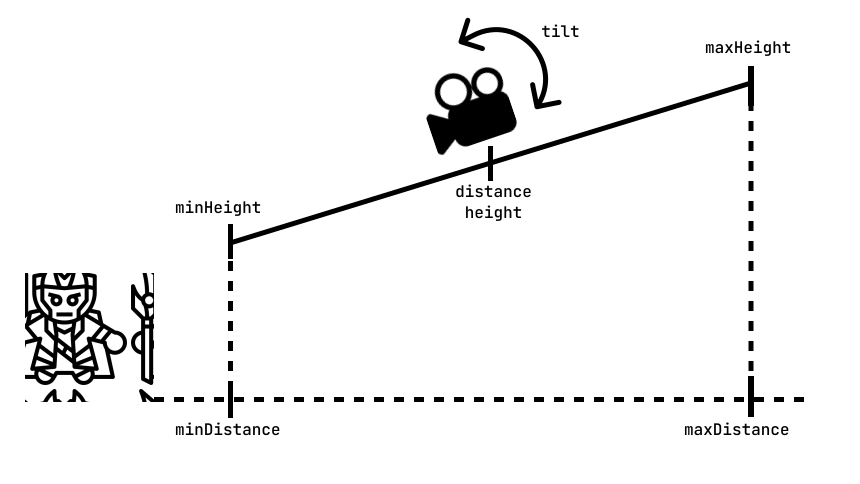

<script setup lang="ts">
  import { ref, onMounted } from "vue";
  import ComponentExample from "../vue/ComponentExample.vue";
  import ForestFlight from "./demo-games/forest-flight/ForestFlight.vue";
  import DragonsQuest from './demo-games/dragons-quest/DragonsQuest.vue';
  
    const renderScene = ref(false);

  onMounted(async () => {
    try {
      // Here import Spatial Design System components that you need
      await import("spatial-design-system/components/position.js");
      renderScene.value = true;
    } catch (e) {
      console.error(e);
    }
  });
</script>

# {{ $frontmatter.title }}
The `game-view` component controls the camera in an A-Frame scene. It supports multiple camera modes like fixed, third-person, and rotating views. The component also supports zoom.

::: warning ⚠️ Project setup required
The `game-view` component relies on A-Frame, ammo.js and the physics system, which must be loaded as UMD globals before use. Follow [Game components — Setup](/game-components/setup) to prepare a fresh project before continuing.
:::

## Import

Once the [project setup](/game-components/setup) is in place, side-effect import the component so it self-registers on `AFRAME`:

```js
import "spatial-design-system/components/game/gameview.js";
```

## Example: thirdPersonFollow type
Camera follows the player and rotates with it. The `target` must be set.

<DragonsQuest/>

```html
<a-entity camera 
  game-view="
    target: #fox-character; 
    type: thirdPersonFixed; 
  "
></a-entity>
```

## Example: thirdPersonFixed type 
Camera follows the player but keeps the same world direction. The `target` must be set.

<ForestFlight/>

```html
<a-entity camera 
  game-view="
    target: #fox-character; 
    type: thirdPersonFollow; 
  "
></a-entity>
```

## Quick start (How it works)
### **Camera Type (`type`):**
- Defines the camera behavior mode (default value: `thirdPersonFollow`).
  - `thirdPersonFollow`: Follows the target and automatically rotates with it.
  - `thirdPersonFixed`: Follows the target but does not rotate with it.
  - `quarterTurn`: Follows the target but rotates in 90-degree steps based on user input.
  - `fixed`: Static camera at a set position and rotation.
    - For this type, jump to the [fixed](#fixed) section below for specific settings.
```html
<a-entity camera 
  game-view="
    type: thirdPersonFollow;
  "
></a-entity>
```

### **Target:**
- `target`: CSS selector for the entity the camera should follow (default value: `null`).
    - NOTE: Required for `thirdPersonFixed`, `thirdPersonFollow`, and `quarterTurn`.
```html
<a-entity camera 
  game-view="
    target: #fox-character; 
  "
></a-entity>
```

### **Camera Positioning:**
- `distance`: Horizontal distance from the target (default value: `5`).
- `height`: Vertical height above the target (default value: `5`).
- `tilt`: Vertical camera angle/tilt in degrees (default value: `-20`).
```html
<a-entity camera 
  game-view="
    distance: 5; 
    height: 5; 
    tilt: -20;
  "
></a-entity>
```

### **Zoom:**
- `zoom`: Enables zooming with the mouse wheel for target-following cameras (default value: `false`).
```html
<a-entity camera 
  game-view="
    zoom: true; 
  "
></a-entity>
```
- `zoomSpeed`: Speed of the zoom effect (default value: `0.3`).
```html
<a-entity camera 
  game-view="
    zoom: true; 
    zoomSpeed: 0.3;
  "
></a-entity>
```
- `minDistance`: Minimum zoom distance from the target (default value: `2`).
- `maxDistance`: Maximum zoom distance from the target (default value: `15`).
- `minHeight`: Minimum camera height when zooming (default value: `2`).
- `maxHeight`: Maximum camera height when zooming (default value: `15`).
- `minTilt`: Camera tilt (in degrees) when fully zoomed in, at `minDistance` (optional, disabled by default). When set together with `maxTilt`, the tilt is interpolated across the zoom range instead of staying fixed at `tilt`. Useful for showing a wider, more top-down area when zooming out.
- `maxTilt`: Camera tilt (in degrees) when fully zoomed out, at `maxDistance` (optional, disabled by default). Remember that more negative values tilt the camera further toward a top-down view.
```html
<a-entity camera 
  game-view="
    zoom: true; 
    
    minDistance: 2;
    maxDistance: 15;
    
    minHeight: 2;
    maxHeight: 15;
    
    minTilt: -20;
    maxTilt: -50;
  "
></a-entity>
```

### **Quarter-Turn Rotation:**
- NOTE: Only applies to the `quarterTurn` type.
- `rotationSpeed`: Speed of the 90-degree rotation step (default value: `5`).
```html
<a-entity camera 
  game-view="
    type: quarterTurn; 
    rotationSpeed: 5;
  "
></a-entity>
```
- `keyTurnLeft`: Key to rotate the camera left (default value: `q`).
- `keyTurnRight`: Key to rotate the camera right (default value: `e`).
```html
<a-entity camera 
  game-view="
    type: quarterTurn; 
    keyTurnLeft: q;
    keyTurnRight: e;
  "
></a-entity>
```

### **Fixed Camera Settings:**
- NOTE: Only applies to the `fixed` type.
- `position`: Static 3D coordinates for the camera (default value: `0 10 0`).
- `rotation`: Static rotation angle for the camera (default value: `-20 0 0`).
```html
<a-entity camera 
  game-view="
    type: fixed; 
    position: 0 10 0;
    rotation: -20 0 0;
  "
></a-entity>
```
### **Camera Offset Angle:**
- `cameraOffsetAngle`: Adjusts the rotational offset of the camera relative to the target (default value: `auto`).
    - `auto`: Automatically syncs with the target's `forwardOffsetAngle` (from `walk` or `fly` components) to stay aligned behind the character.
    - Can be overridden with a specific number (e.g., `90`) to manually offset the view 
```html
<a-entity camera 
  game-view="
    cameraOffsetAngle: auto;
  "
></a-entity>
```

## fixed
The camera stays in a fixed position and rotation, defined by the `position` and `rotation` properties. It does not follow any object and stays in the same place.
```html
<a-entity camera 
  game-view="
    type: fixed; 
    position: 0 10 0;
    rotation: -20 0 0;
  "
></a-entity>
```

## thirdPersonFixed
The camera follows the `target` at a set `distance` and `height`, but it does not rotate with the target. Its orientation stays the same even if the character turns. Optionally enable `zoom` to allow dynamic distance changes.

```html
<a-entity camera 
  game-view="
    target: #fox-character; 
    type: thirdPersonFixed; 
    distance: 5; 
    height: 5; 
    tilt: -20;
  "
></a-entity>
```

## thirdPersonFollow
The camera follows the `target` and rotates together with it. It stays behind the character and creates a classic third-person game view.
You can adjust `distance`, `height`, and `tilt` to control the camera position and angle, and you can enable `zoom` to allow the player to move the camera closer or farther away.

```html
<a-entity camera 
  game-view="
    target: #fox-character; 
    type: thirdPersonFollow; 
    distance: 5; 
    height: 5; 
    tilt: -20;
  "
></a-entity>
```

Tip: Use very small `distance` + eye-level `height` to simulate first-person.

## quarterTurn 
The camera follows the `target` but does not rotate automatically with it. Instead, the user can rotate the camera around the target in 90-degree steps using defined keys.
You can adjust `distance`, `height`, and `tilt` to control the camera position, enable `zoom` if needed, and configure `rotationSpeed`, `keyTurnLeft`, and `keyTurnRight` to control how the camera rotates around the target.

```html
<a-entity camera 
  game-view="
    target: #fox-character; 
    type: quarterTurn; 
    distance: 5; 
    height: 5; 
    tilt: -20;
    rotationSpeed: 5;
    keyTurnLeft: q;
    keyTurnRight: e;
  "
></a-entity>
```

## zoom
The camera has an initial position defined by `height` (above the player) and `distance` (away from the player).
The zoom moves the camera forward and backward along a fixed diagonal line defined by `minDistance`, `maxDistance`, `minHeight`, and `maxHeight`.
When the user scrolls the mouse wheel (if `zoom` is set to true), the camera moves closer to or farther from the target, 
but only between the limits.
This means the camera always stays within a safe range and never gets too close to the object or too far away.
The speed of this movement is controlled by `zoomSpeed`, and the vertical viewing angle is defined by the `tilt` property.
Optionally, you can set `minTilt` and `maxTilt` to interpolate the tilt across the zoom range — for example, tilting the camera toward a more top-down angle as the player zooms out to reveal a wider area around the character.\
You can use the zoom in any of the target-following modes (`thirdPersonFixed`, `thirdPersonFollow`, `quarterTurn`) to allow players to adjust their view dynamically.

<picture>
    <source srcset="../assets/game/Zoom.svg" media="(max-width: 576px)">
    
</picture>

```html
<a-entity camera 
  game-view="
    target: #character; 
    type: thirdPersonFixed; 
    zoom: true;
    
    distance: 5; 
    minDistance: 2;
    maxDistance: 20;
    
    height: 5; 
    minHeight: 2;
    maxHeight: 20;
    
    tilt: -20;
  "
></a-entity>
```

::: warning Keep the starting values aligned with one end of each range
The zoom maps a single progress value (0 → 1) across the whole zoom line, so every
range-based attribute moves together. Because of this, the initial `distance`, `height`,
and `tilt` you set are **not** recalculated until the player actually scrolls — they are
used exactly as written for the first frame.

To avoid a visible jump on the first scroll, always set each starting value to match
**the same end** of its range — either all the minimum values (fully zoomed in) or all
the maximum values (fully zoomed out):

- `distance` must equal `minDistance` **or** `maxDistance`
- `height` must equal `minHeight` **or** `maxHeight` (the same end as `distance`)
- `tilt` must equal `minTilt` **or** `maxTilt` (the same end), when tilt interpolation is enabled

Mixing ends (for example starting at `maxDistance` but `minHeight`) places the camera
off the zoom line, so the first scroll will snap it back onto the line.
:::

The following example shows an optimal, fully consistent configuration for a
`thirdPersonFollow` camera. The character starts **fully zoomed out**, so every starting
value is set to the maximum end of its range (`distance` = `maxDistance`,
`height` = `maxHeight`, `tilt` = `maxTilt`):

```html
<a-entity camera 
  game-view="
    target: #monster-character; 
    type: thirdPersonFollow;
    zoom: true; 
    zoomSpeed: 0.1;
    
    distance: 5; 
    minDistance: 4; 
    maxDistance: 5;
    
    height: 20; 
    minHeight: 5; 
    maxHeight: 20;
    
    tilt: -70; 
    minTilt: -20; 
    maxTilt: -70;
  "
  rotation="-30 0 0"
></a-entity>
```

## Props
| Property | Type | Default | Description | Used in |
|---|---|---|---|-|
|_target_|selector||Specifies the entity that the camera should follow.|thirdPersonFixed, thirdPersonFollow, quarterTurn|
|_height_|number|5|Sets the vertical height of the camera above the target entity.|thirdPersonFixed, thirdPersonFollow, quarterTurn|
|_distance_|number|5|Defines the horizontal distance between the camera and the target.|thirdPersonFixed, thirdPersonFollow, quarterTurn|
|_tilt_|number|-20|Controls the vertical angle of the camera in degrees, tilting it toward the target.|thirdPersonFixed, thirdPersonFollow, quarterTurn|
|_type_|enum(thirdPersonFixed, thirdPersonFollow, fixed, quarterTurn)|thirdPersonFixed|Selects the camera mode and behavior.||
|_zoom_|boolean|false|Enables or disables zooming with the mouse wheel.|thirdPersonFixed, thirdPersonFollow, quarterTurn|
|_zoomSpeed_|number|0.3|Defines how fast the camera moves when zooming in or out.|thirdPersonFixed, thirdPersonFollow, quarterTurn|
|_minDistance_|number|2|Sets the minimum allowed horizontal distance from the target or start position.|thirdPersonFixed, thirdPersonFollow, quarterTurn|
|_maxDistance_|number|15|Sets the maximum allowed horizontal distance from the target or start position.|thirdPersonFixed, thirdPersonFollow, quarterTurn|
|_minHeight_|number|2|Sets the minimum allowed height of the camera.|thirdPersonFixed, thirdPersonFollow, quarterTurn|
|_maxHeight_|number|15|Sets the maximum allowed height of the camera.|thirdPersonFixed, thirdPersonFollow, quarterTurn|
|_minTilt_|number|—|Camera tilt in degrees when fully zoomed in (at `minDistance`). Optional; when set with `maxTilt`, tilt is interpolated across the zoom range instead of staying fixed at `tilt`.|thirdPersonFixed, thirdPersonFollow, quarterTurn|
|_maxTilt_|number|—|Camera tilt in degrees when fully zoomed out (at `maxDistance`). Optional; pairs with `minTilt`.|thirdPersonFixed, thirdPersonFollow, quarterTurn|
|_rotationSpeed_|number|5|Defines how fast the camera rotates between 90-degree steps.|quarterTurn|
|_keyTurnLeft_|string|q|Defines the key used to rotate the camera 90 degrees to the left.|quarterTurn|
|_keyTurnRight_|string|e|Defines the key used to rotate the camera 90 degrees to the right.|quarterTurn|
|_position_|string|0 10 0|Sets the initial position of the camera in the scene.|fixed|
|_rotation_|string|-20 0 0|Sets the initial rotation of the camera in degrees.|fixed|

## Events

The `gameview` component emits the following events when the camera changes, so other
components can react to the view:

| Event          | Parameters                            | Description                                                      |
| -------------- | ------------------------------------- | ---------------------------------------------------------------- |
| _zoom-changed_ | `{ distance: number, height: number, tilt: number }`| Emitted when the camera zoom changes (requires `zoom`). Returns the new camera `distance`, `height`, and `tilt`. |
| _view-rotated_ | `{ angle: number }`                   | Emitted when the view is rotated by a quarter turn (requires `quarterTurn`). Returns the new target angle in degrees. |

::: tip Note
You can listen to these events to sync UI (such as a minimap or compass) with the camera.

```js
el.addEventListener("view-rotated", (event) => {
  console.log(event.detail.angle);
});
```
:::

## Credits & 3D Models Attribution
The project utilizes 3D assets from [Poly.pizza](https://poly.pizza/). Below is the attribution for each model used in the games.

### Creative Commons Attribution (CC BY)
*The following models require attribution to the original creator as per the [CC BY 3.0](https://creativecommons.org/licenses/by/3.0/) license.*
| Model Name | Author |
| :--- | :--- |
| [**Island**](https://poly.pizza/m/bzLVwG4AzvA), [**Volcano**](https://poly.pizza/m/dwSigTeSMCo), [**Paper airplane**](https://poly.pizza/m/75WQH5E29tF) | Poly by Google |
| [**Island**](https://poly.pizza/m/C03O8OQq6O) | J-Toastie |
| [**Mountain**](https://poly.pizza/m/6qp53W5djC5) | Servin Nissen |
| [**Tree Assets**](https://poly.pizza/m/eLqmfpqu_Ig) | Ben Desai |

### Public Domain (CC0)
*The following models are provided under the [CC0 1.0](https://creativecommons.org/publicdomain/zero/1.0/) license (Public Domain).*
| Model Name | Author |
| :--- | :--- |
| [**Demon**](https://poly.pizza/m/Mo2ky6vkf8), [**Tribal**](https://poly.pizza/m/t91lDHaqRW), [**Yeti**](https://poly.pizza/m/xtMYEVzyw0), [**Dragon**](https://poly.pizza/m/VBvzjFIYws), [**Dock**](https://poly.pizza/m/XViKoBh2UN), [**Fox**](https://poly.pizza/m/Bc97C66HKi), [**Rock**](https://poly.pizza/m/4MUaQTcDdc) | Quaternius |

## What's next?
- [fly](./fly.md) - Enables flying. Customize controls, speed, and flight style (with pitch and roll).

- [walk](./walk.md) - Enables player movement. Supports walking, sprinting, turning, auto-walk, and click-to-move.

- [npc-walk](./npc-walk.md) - Moves NPCs along paths. Supports speed setup, looping, and random movement.