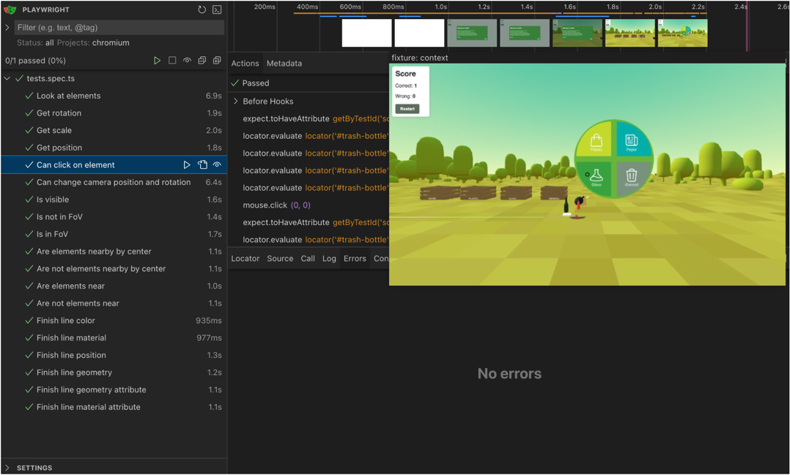

# {{ $frontmatter.title }}

Testing in XR environments can be challenging due to the unique nature of AR/VR applications. 
We created an extension to the popular frontend testing framework Playwright, which allows you to write tests for your A-Frame applications in a more efficient and effective way.

See instrcutions in the repository and start writing tests for your A-Frame applications today!

[Playwright A-Frame E2E Testing Library](https://github.com/SpatialHub-MENDELU/playwright-aframe)

