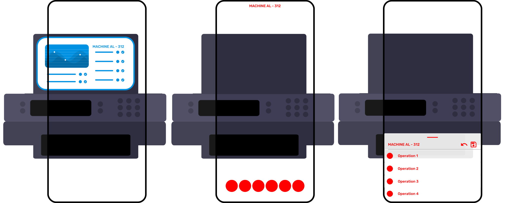

# {{ $frontmatter.title }}

### Use cases

- Immersive experiences like games, entertainment apps, simulations or manuals
- To provide immersive experience due to user not leaving the AR scene
- To visually bind the menu to the context of a physical or virtual object
- To force the user to work with both the virtual and physical objects at once

### Risks

- When used in applications where high immersion is not expected, the 3D menu can be perceived as an unnecessary 
complication and discomfort. (not so bad)
- In use cases where it takes some time to interact with the menu, it forces the user to hold the AR device in an 
uncomfortable position for a prolonged time, leading to hand pain and shaking. When the device is shaking, also the menu 
is moving. Then, it is hard to interact with the menu. (bad)
- Such menu usually required two hands to interact with it. (not so bad)

### Example

For immersive experiences, like AR manuals, the 3D menu (left) is the best choice. It is visually bound to the context of the game, e.g. to 
a physical object. The user can interact with the menu without leaving the AR scene. 

Other menu types, like floating buttons (middle) or bottom sheet (right), would drag the user out of the immersive 
experience.

<picture>
    <source srcset="../assets/guidelines/3D-menu/Mobile.svg" media="(max-width: 576px)">
    
</picture>

### Implementation

Use our [menu](/ar-vr-primitives/menu) primitive to create a 3D menu. 
Optionally, apply [adaptive](/guidelines/adaptive) or [follow](/guidelines/follow) behaviors to reduce negative effects
like hand shaking or unnecessary user movements.