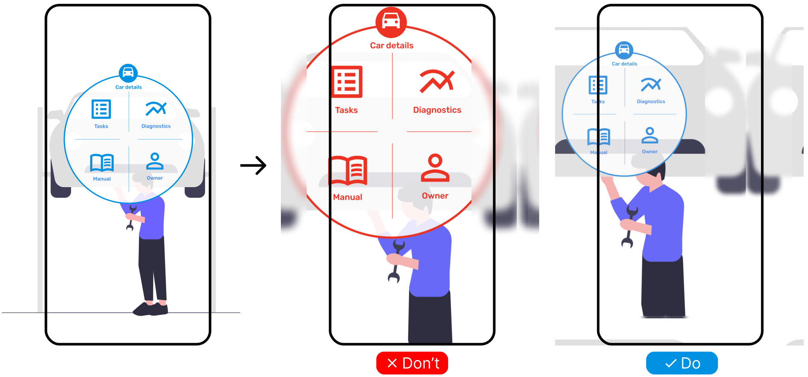

# {{ $frontmatter.title }}

### Use cases

- Use when the user can be anywhere in the room.
- Use when the user can work with the physical object from an angle.
- Use when the user can work with the physical object from a distance.
- Use when you are not sure which behavior to choose, this is the best default and the safest option.

### Risks

- This behavior disturbs immersive experiences in games (not so bad)
- This can cause the element to overlap with other UI elements (not so bad)
- If more elements have applied adaptive scaling, it may be very confusing for the user, especially when the user is far away from the element's origin. (bad)

### Example

When a user approached closer to the car, the menu should adapt its size and rotation, so it is comfortable to use.

<picture>
    <source srcset="../assets/guidelines/Adaptive/Mobile.svg" media="(max-width: 576px)">
    
</picture>

### Example applications

- Controlling smart light color
- Opening windows curtains
- Showing labels on an engine
- Ordering a drink in a bar

### Implementation

Use [auto-scale](/ar-vr-components/auto-scale) to apply automatic **scaling**. It is calculated as the object's default scale multiplied by the distance between the user and the object.

Use [fit-into-fov](/ar-vr-components/fit-into-fov) to apply **scaling** of the object so that it fits into the user's **field of view**. It is calculated based on a percentage of display size. Combine it with [auto-scale](/ar-vr-components/auto-scale) to apply automatic scaling of the object.

Use [billboard](/ar-vr-components/billboard) to apply automatic **rotation** so that the object is always facing the user.
