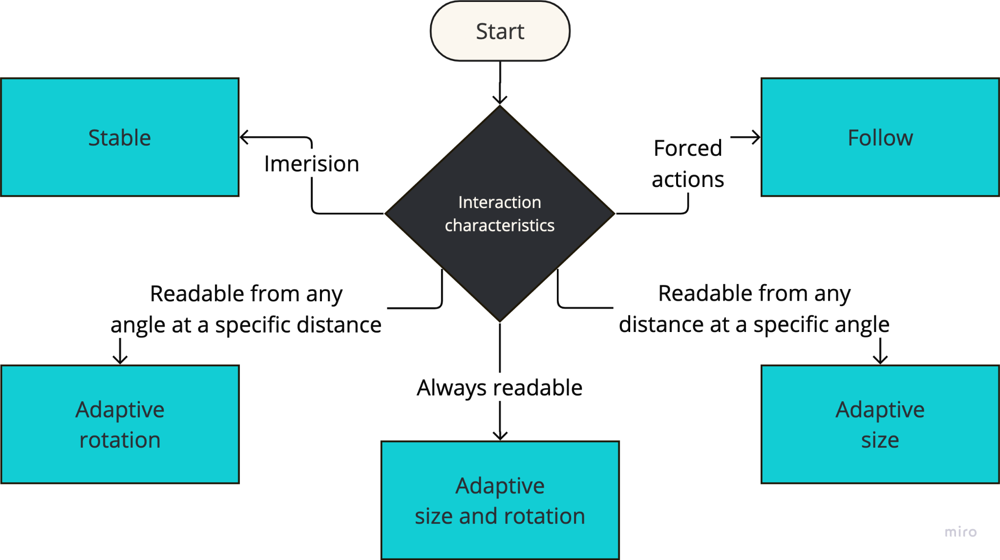

# {{ $frontmatter.title }}

This section describes the behavior of the UI elements in the AR/VR environment. Elements may be
positioned on a fixed position or adapt their position and scale based on the user's position and distance
from the UI element.

Use the following guidelines to choose the right behavior for your app. If you are not sure, go for
the [adaptive behavior](#adaptive-size-and-rotation).

### Stable

Use if your app requires at least one of the following:

- Immersive experiences
- Need to draw attention to a specific physical object
- User must be at a precise position to a physical object
- Safety-critical applications where it is not safe to control a physical object from a distance

[See details](/guidelines/stable.md)

### Adaptive

Use if your app requires the following:

- User can be anywhere in the room
- User can work with the physical object from an angle
- User can work with the physical object from a distance
- You are not sure which behavior to choose, this is the best default

Of course, you can apply only adaptive size or adaptive rotation solely if needed. However,
it is not common to use only one of them.

[See details](/guidelines/adaptive.md)

### Follow

Use if your app requires at least one of the following:

- Forcing the user to work with the element
- Enable user to look away from a physical object without loosing control
- User can be anywhere in the room and look to any direction
- Something is really important that must be always visible and preferred over other elements

[See details](/guidelines/follow.md)
