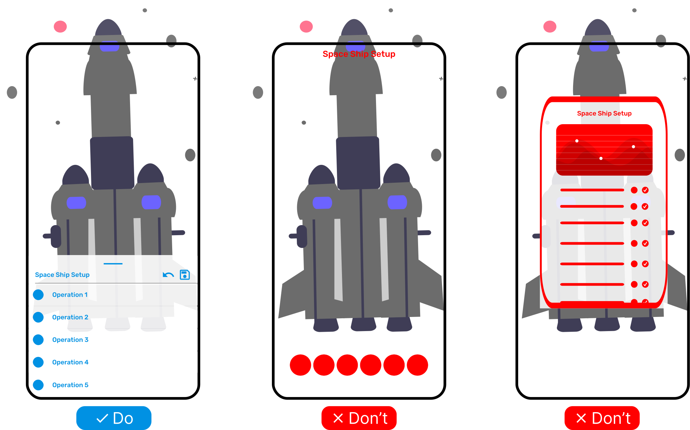

# {{ $frontmatter.title }}

### Use cases

- Everyday practical applications
- Easy of use and traditional design is preferred
- User can comfortably move away from a physical location and look away in any direction
- Menu is stable and never shaking

### Risks

- In cases where immersive experience is required, bottom sheet can be distracting
- Bottom sheet overlaps a significant portion of the AR scene
- Bottom sheet is not clearly connected to any object in the AR scene

### Example

For complex selection of configuration options during a space ship start-up sequence, a bottom sheet can be
used. It takes time to go through all the options and the user can comfortably look away from the spaceship
and work only with the bottom sheet.

Other menu types like floating buttons or 3D menu are not suitable because they provide less space
and are less stable.

<picture>
    <source srcset="../assets/guidelines/Bottom-sheet/Mobile.svg" media="(max-width: 576px)">
    
</picture>

### Implementation

We do not provide components for bottom sheets as they are platform specific.
Follow the [Material Design guidelines](https://material.io/components/sheets-bottom)
and [Human Interface Guidelines](https://developer.apple.com/design/human-interface-guidelines/ios/views/action-sheets/).

However, we have prepared an experimental primitive to simulate a bottom sheet menu. However, if you need to use it in
AR mode, you will need a WebXR overlay element. We will add details later.

```html
<a-bottom-sheet-menu
  title="App menu"
  items="[
            {icon: '/start', title: 'Start'},
            {icon: '/configure', title: 'Configure'},
            {icon: '/exit', title: 'Exit'}
        ]"
>
</a-bottom-sheet-menu>
```
