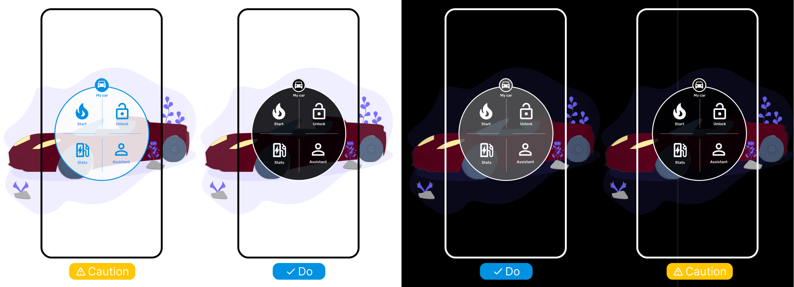

# {{ $frontmatter.title }}

## Risks

- Insufficient contrast between your elements and scene can make UI elements difficult to read and understand
  (not so bad)

<picture>
    <source srcset="../assets/guidelines/Color-Modes/Mobile.svg" media="(max-width: 576px)">
    
</picture>

## Guidelines

- Add contrastive background to the UI elements to make them more visible and readable.

The best color mode is dark background and light text. It is suitable for most situations.
Using dark text on white background is also possible, but it works well primarily in light environments.
Most environments are complicated and more dark than light, so dark text would be mixing with the environment.
See difference between first two pictures above.

## Specification

| Scene                                 | Text/icon color        | Background color  |
| ------------------------------------- | ---------------------- | ----------------- |
| Default, suitable for most situations | light color like white | transparent black |
| Light environments                    | black                  | transparent white |
| Completely dark environments          | white                  | transparent gray  |
