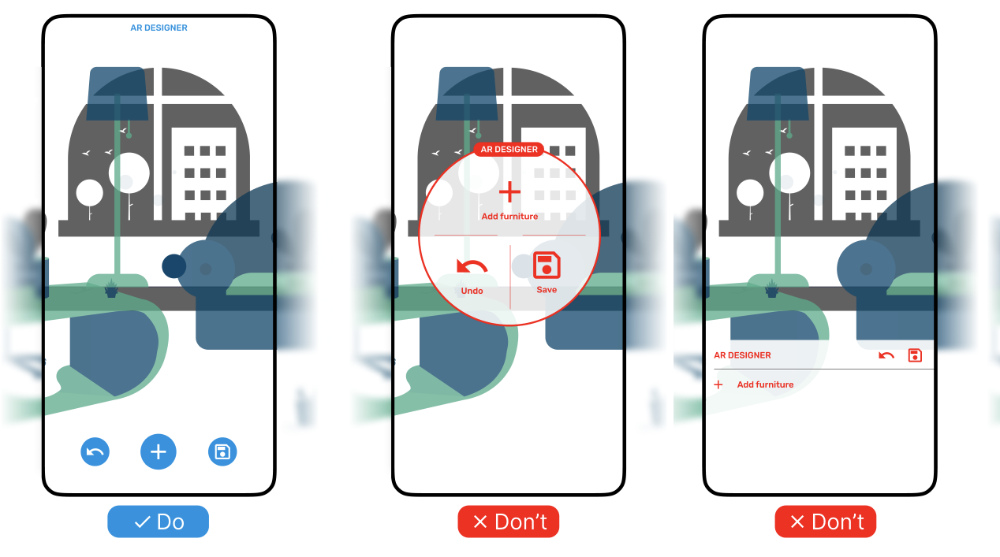

# {{ $frontmatter.title }}

### Use cases

- A small number of well-known actions that are important, but not in the primary focus.
- Buttons for global actions like "save", "add object" and "settings".
- Buttons for selecting tools like "pen", "eraser", "color picker".
- Also, may be actions of the currently selected object, like "delete", "duplicate", "edit".
- Buttons for navigation like "next", "previous", "up", "down".
- Provides a comfortable way to access actions without hiding the AR scene and letting the user move freely.

### Risks

- Floating buttons are usually small and without labels. If unfamiliar icons are used,
    users may not understand their meaning. (bad)
- If there are too many actions, there might be too many similar buttons close to each other.
    Users may be confused and accidentally click the wrong button. (not so bad)
- Distracts user from the AR scene and the relevant object. However, much less compared to bottom sheet and 2D menu. (not so bad)
- Partially overlaps the AR scene, but less than bottom sheet and 2D menu. (not so bad)

### Example

Quick well-known actions like adding an object, saving and undo are placed at the bottom of the screen 
as floating buttons (left). Using larger elements like 3D menu (middle) or bottom sheet (right) would be an overkill.

<picture>
    <source srcset="../assets/guidelines/Floating-Buttons/Mobile.svg" media="(max-width: 576px)">
    
</picture>

### Implementation

We don't have a specific component for floating buttons. You must implement it by yourself based on
your platform's guidelines.