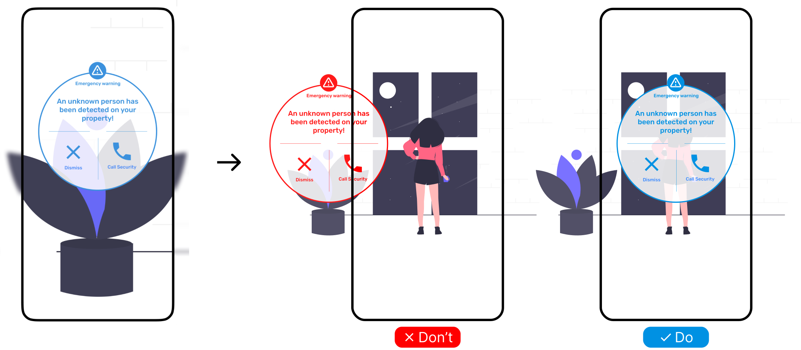

# {{ $frontmatter.title }}

### Use cases

- User can be anywhere in the room and look to any direction.
- User can look away from the physical object without losing control.
- Forcing the user to work with the element.
- Something is really important that must be always visible and preferred over other elements.

### Risks

- The element overlaps with other UI elements and covers the scene (bad)
- Follow does not preserve the immersive experience and context, it may not be clear to which physical object is the element related (not so bad)
- The element is always in front of the user, it may be irritating, especially if it cannot be closed (bad)
- May be confusing if used for multiple elements at the same time (bad)

::: warning
This behavior may be extremely comfortable for the user, but it may easily become irritating if not used correctly.
Use it only for use cases mentioned above. This behavior is not recommended for general use.
:::

### Example

This example shows an important alert dialog that an unknown person was detected in the property.
The user changed his point of view from the plant on the left to the girl on the right, and the element should always be
in front of the user in the center of the field of view to draw full attention to the alert.

<picture>
    <source srcset="../assets/guidelines/Follow/Mobile.svg" media="(max-width: 576px)">
    
</picture>

### Example applications

- Alerting the user about a dangerous situation
- Showing a user's health status
- Incoming call notification
- Error message
- Confirmation to close the app

### Implementation

Use [follow-camera](/ar-vr-components/follow-camera) to apply automatic **positioning** of the object so that it is always in front of the user.
Usually _follow_ is combined with [billboard](/ar-vr-components/billboard) and [fit-into-fov](/ar-vr-components/fit-into-fov).
