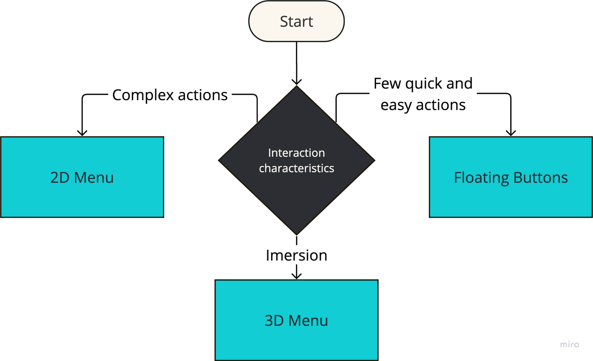

# {{ $frontmatter.title }}

These guideline wil help you to decide which menu type is the best for your AR/VR application. 

Although the target platform of our system is AR and VR, using a 2D menu overlay over a AR/VR scene may be a good choice for some applications.
Users are familiar with 2D menus from other applications, and 2D menus are more comfortable due to their static position and 
standard user interface.

This section describes different menu types that can be used in AR/VR applications. 
The first decision you need to make is to choose whether you need a global menu or a context menu.

## Global menu

Global menus are used to provide access to the most common features of the application,
 features that are **not related to a specific object** in the scene.
They are usually placed in a fixed position in the user's field of view.

### Use cases

- Global app settings
- Navigation
- Main menu
- Help
- User profile
- Ongoing call

### Menu types

For global menus, you can choose from the following types:

- [2D menu](/guidelines/2d-menu) - for complex actions, like app settings.
- [3D menu](/guidelines/3d-menu) - for immersive experiences, like games.
- [Floating buttons](/guidelines/floating-buttons) - for quick and easy actions, like navigation or tool selection.

## Context menu

Context menus are used to provide access to actions that are relevant to the current context, usually 
**related to a selected object** in the scene. 

### Use cases

- Object manipulation
- Object information
- Object settings

### Menu types

For context menus, you can choose from the following types:

- [3D menu](/guidelines/3d-menu) - for immersive experiences, like games or AR manuals.
- [Bottom sheet](/guidelines/bottom-sheet) - for complex actions, like purchasing the selected object.
- [Floating buttons](/guidelines/floating-buttons) - for quick actions, like object manipulation.
- [Hybrid menu](/guidelines/hybrid-menu) - for an advanced user that may switch between 2D and 3D menu.
- [2D menu](/guidelines/2d-menu) - for complex actions that require more space, like purchasing the selected object with customization.

