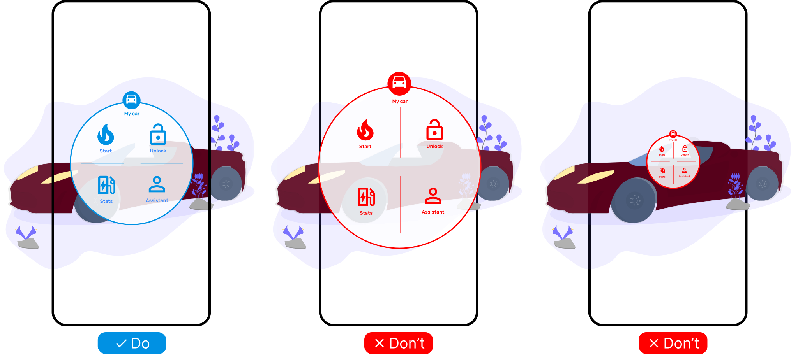

# {{ $frontmatter.title }}

## Risks

- Too small element may not be able to be read and interacted with, and user must approach the UI element to read it
  (not so bad)
- Too large element that it does not fit into the field of view (FOV) of the device, and the user may step back from the UI element,
  which can be dangerous (bad)

<picture>
    <source srcset="../assets/guidelines/Size/Mobile.svg" media="(max-width: 576px)">
    
</picture>

## Guidelines

Guidelines differ based on the use case.

### Games and immersive experiences

Use cases where immersive experience is the main goal, like AR games, or where the position of user is crucial, like
an engine repair manual or an escape game:

- Text and icons are of the same size as they would be on real objects such as a TV screen or poster.
- The size is set up as an absolute fixed value in centimeters/meters
- The user must approach the UI element to read it.
- Do not set up so large to avoid the user stepping back from the UI element (dangerous).

::: tip
If the element must have fixed size but the user must be able to use it from a distance, consider hiding texts and
using only icons when the distance between the user and the UI element is greater than a threshold distance.
:::

### AR applications

However, in most applications you do not care about the user's position, and the user can be anywhere in the room.
In such use cases the element should be adaptive to the user's position and distance from the UI element.
Use one or both of the following strategies:

- Set the default size of the element to fit into the field of view (FOV) of the device -> see [fit-into-fov](/ar-vr-components/fit-into-fov.md)
- Resize the whole element based on the distance between the user and the UI element -> see [auto-scale](/ar-vr-components/auto-scale.md)

::: tip
Call fit-into-fov in the moment of spawning the element or anytime you want to ensure that the element fits into the FOV.
Combine fit-into-fov with auto-scale to ensure that the element always fits into the FOV and is readable.
:::

## Specification

| Element                   | Minimum size for comfortable reading | Readability threshold (under excellent conditions) |
| ------------------------- | ------------------------------------ | -------------------------------------------------- |
| Longer texts (paragraphs) | 16pt                                 | 5pt                                                |
| Shorter texts (labels)    | 8pt                                  | 4pt                                                |
| Icons                     | 24pt                                 | 12pt                                               |

::: tip
Follow [Material Design](https://m2.material.io/design/typography/the-type-system.html) and
[Human Interface Guidelines](https://developer.apple.com/design/human-interface-guidelines/typography) to find out what
are the recommended sizes for text and icons for your platform. Ensure
that your texts fit into these recommendations.
:::
