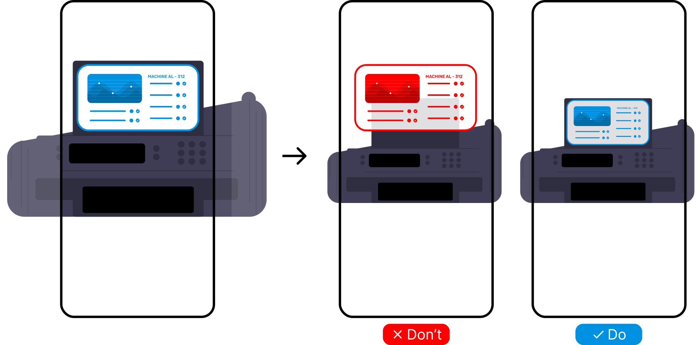

# {{ $frontmatter.title }}

### Use cases

- Immersive experiences like games, escape rooms, or virtual tours.
- Use when you have a static element like a signpost or a label on a physical object.
- Use when you need to indirectly control where user is located in the physical space. 
When user is too close or too far away, the element is not readable and the user must move to the correct location.

### Risks

- User cannot interact with the UI element from a distance or from an angle (not so bad)
- Element is too far away or too close to the user, cannot be read, stepping back is dangerous (bad)

### Example

TODO

<picture>
    <source srcset="../assets/guidelines/Stable/Mobile.svg" media="(max-width: 576px)">
    
</picture>

### Example applications

- A label pinned to entrance of a room showing the room number
- A hidden key in an escape game
- AR manual for sensitive laboratory equipment that cannot be worked with from a distance
- A museum guide that forces users to not touch the exhibits

### Implementation

No special component needed. Just set the element's position to a fixed value or pin the object to the position of a detected physical object.