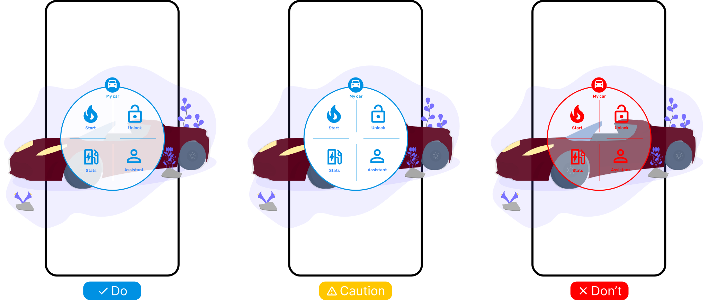

# {{ $frontmatter.title }}

## Risks

- No transparency of UI elements leads to less immersive experience and can be confusing for the user
  (not so bad)
- Too high transparency can make the UI elements unreadable (bad)

<picture>
    <source srcset="../assets/guidelines/Transparency/Mobile.svg" media="(max-width: 576px)">
    
</picture>

## Guidelines

- Use appropriate transparency so that users see the real world behind the UI elements.
  It helps with orientation and makes the experience more immersive.
- Do not set transparency more than 50% to ensure that the user can read the text and see the icons.

## Specification

| Goal                                                 | Transparency |
| ---------------------------------------------------- | ------------ |
| Critical elements like alert, draw attention of user | 10%          |
| Standard best default                                | 35%          |
| Immersive experience and orientation in scene        | 50%          |
